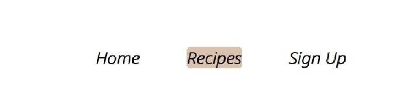

## Journey into Vitality is a website focusing on natural medicine and wellbeing.
> Live demo [_here_](https://edytaj.github.io/journey-to-vitality/). 

## Table of Contents
* [General Info](#general-information)
* [Technologies Used](#technologies-used)
* [Features](#features)
* [Design](#design)
* [User Experience](#user-experience)
* [Structure](#structure)
* [Room for Improvement](#room-for-improvement)
* [Testing](#testing)
* [Deployment](#deployment)
* [Credits](#credits)

## General Information

The main purpose of the Journey into Vitality website is to share, share my knowledge and my passion: wellbeing, power of nature, herbs and healthy dietary choices. All of these are something that I have been learning up until now, I share knowledge and experiences that I tested on myself. I believe in nature and I believe that we are all able to heal, to start over and reset our health. My main goal is to help others and bring awareness and choices to the ones that are open to try new things, to people who struggle with their health but also to those who are just looking to use what nature has to offer and improve their wellbeing. I believe content I included in my first ever website and I hope that it reaches someone who will use it and benefit from it- this would be my ultimate goal.

## Technologies Used

* CSS3

* HTML5

* GITHUB

* GITPOD

## Features

* I have created a website that is fully responsive on all screen sizes

* Users are able to interact and have the opportunity to chose herbs that might be decsribed in depth in next newsletter.

## Design

* Color scheme

I used simple color scheme to create this website.
The footer color (#DBC2AD) is in keeping with the palette yet allow user to distinguish this section from the others on the particular page.

The same color (#DBC2AD) is used for JOIN US button and SUBMIT button on vote form on main home page. 

* Typography

Headings are in Rock Salt and normal text is in Noto Sans.
Rock Salt is handcrafted with felt-tip markers that makes it look personable.
I paired this bold and edgy handwritten font with a web-oriented sans-serif font. Both fonts are clean and easily readable, this combination sis frequently used on wellbeing and health websites
Sans serif is the fallback font in case the chosen font cannot be imported correctly.

* Icons

I used icons from font awesome, to add visual indicators. Link here: [Font awesome (https://fontawesome.com)]

* Imagery

 Main hero image of green herbs on marble table has been inspiring me to create website that is clean looking and appealing. Website that is showing the beauty of nature- herbs and nutrition.
[The main image of the herbs (www.pinterest.com)]

The main home page includes background image used in the main section. I chose sage green marble wallpaper to make this section pop. [background sage green marble wallpaper background (www.pinterest.com)] The same image is used in Recipes section as a background to the ingredients part.

The recipes section has three images, all of these are inspiring, healthy and appealing:

[Pineapple smoothie from (https://www.evolvingtable.com/tropical-fruit-and-spinach-green-smoothie/)]

[Watermelon smoothie from (https://drkellyann.com/blogs/recipes/cool-watermelon-green-smoothie?_pos=3&_sid=b270fe255&_ss=r)]

[Mango smoothie from (https://skinnyms.com/spinach-and-mango-smoothie/)]

## User Experience

Types of users:

* Users who have some health problems and are looking for help and ideas:

As a person with health conditions, I would like to be able to find information about various herbs and how these can help with what I ma going through.
I would like to be able to find inspiration and ideas of healthy nutrition that I could add to my daily routines.
I would like the content to be written in clear manner and any diatery options to be easy and quick to prepare.

* These are users who are just looking to improve their general wellbeing:

As a person who loves health and nature, I would like to be able to get inspired with ideas of different herbs and how they can improve my daily performance.
I would like to be able to find daily recipes that are easy and not expensive to make and that I could incorporate in my busy life.
I would like to have an option to subscribe to a newsletter and being able to contribute to a content that is being written for this website.

## Structure

### Information Architecture

The webpage has a Homepage and 1 further page. Sign up navigation link is taking User to Footer where one can subscribe.

* ## Header 

Title of the website Journey Into Vitality was chosen to, whilst user is looking for wellbeing sites, bring attantion and curiosity as to what this website can help user with. Title is simple and easy to remember.

* ## Main image

Herbs on a marble table - symbolise nature, cleanliness and beauty. In a simple way, this photo shows the beauty of herbs.

* ## Navigation

Each page is featured with navigation menu. It allows user to qickly and efficiently move around pages.

*I have added background color (#DBC2AD) to the current page navigation link that user is on to make it easier to navigate.

* ## Home page main section

* Main page sub-heading

Sub-heading section describing our mission and what we are here to do, what we can help with and what the user can benefit from whilst being a part of our wellbeiung family. Its a short introduction to our main goal and site content.

Sub-heading and about us section:

* Main page herbs section

Section with description of 3 chosen herbs. Described herbs will let person know what is the herb for, it's form, how to use it. It is a simple explanation without jargon.

* Main home page  vote form.

 User can feel included and vote for the content of next weeks newsletter. There are options of herbs and user is encouraged to be a part of the family and contribute to next weeks choice by voting for his choice of power herbs.

* Footer 

Footer has a different color so its easily distinguished. Footer includes Sign Up form and also links to our Social Media platforms. Its simple looking and easy to navigate.

* Recipes Page

Recipes page includes pictures of the smoothies that we are recommending. Chosen pictures are vibrant and colorful. It is to show user how fun and tasty healthy eating can be.

Recipes page also includes ingredients list under each photo of the green smoothie. We added this to give users idea of how to create simple yet delicious smoothie options. Ingredients list are easy to read and simple to follow.

## Room for Improvement

Room for improvement:

- Herbs card gallery allowing users to find even most unusual herb and read detailed healing benefits plus usage

- Recipes section where users are able to choose from various options: breakfast, lunch, dinner and snacks and by adding their own ingredients from suggested list create their own meal. 

To do:

- Research market and find most researched herbs users are interested in knowing about

## Testing

* Testing results are attached below.

I used W3C validators for my HTML [ Nu HTML checker (https://validator.w3.org/nu/#textarea)] 

and CSS tests [ W3C Css Validation Service (https://jigsaw.w3.org/css-validator/?fbclid=IwAR3BVTQVCwQOTpIjEFUCHlwFSE8kRTiH6-0XioDN8QS14uUOH3FyfCMytnc#validate_by_input)]

* I have also tested if my webpage is responsive on various devices: desktop, laptop, tablet and mobile

I have used Am I responsive [ I am Responsive (https://ui.dev/amiresponsive) and result is seen below. This is to check if my website is fully responsive on all screen sizes. 
 
Link used to run tests:  [(https://edytaj.github.io/journey-to-vitality/)]

* I tested webpage using Lighthouse automated tool for improving the quality of web pages. Lighthouse audited performance, accessibility, progressive web apps and more. Result is attached below:

## Deployment

* For this project I've used GitHub IDE editor. Project was saved/pushed to a GitHub platform cloud using these commands:

git add .

git commit -m "message"

git push

* This project was deployed to GitHub Pages using below steps:

Login to GitHub and open the GitHub Repository.
Within the Repository click on "Settings" on the top of menu.
Go to the "Pages" section.
Under the Sources click the dropdown displaying "None" and select branch to be deployed ("Main").
Click on the "Save" button.
Deployed link is generated at the top in green section (Link might be displayed in blue color, this means that your link is being prepared and is not yet ready. You might need to click refresh button few times until link turns green. Deployed link is then ready.)

## Credits

* Code

HTML&CSS book by Jon Duckett

W3Schools

www.stackoverflow.com

My mentor Spencer Barriball for his support and pointers.

* Content

The content of the webpage is inspired by teachings of two great healers and inspiration to many in regaining vitality: Dr Morse and Medical Medium.

* Media 

Smoothie images:

www.pinterest.com

www.evolvingtable.com

www.drkellyann.com

www.skinnyms.com

